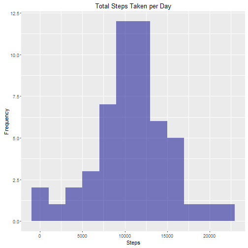
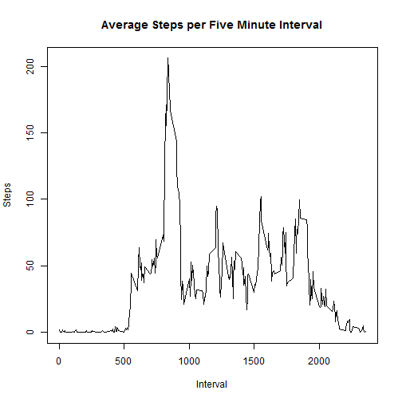
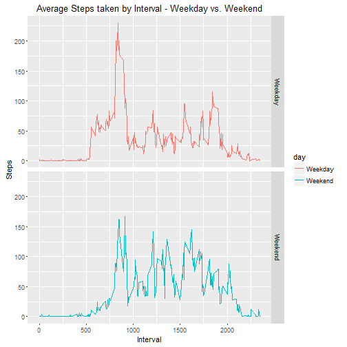

#Loading and Processing the Data

Assuming, the file is in the working directory, it is loaded using read.csv

```r
if(!exists("activity")) {
    activity <- read.csv("activity.csv")
}
```


#What is mean total number of steps taken per day?

1. Calculate the total number of steps taken per day.


```r
totalstepsperday <- aggregate(steps~date, data=activity, FUN=sum)
```

2. Make a histogram of the total number of steps taken each day


```r
library(ggplot2)
g <- ggplot(totalstepsperday, aes(steps)) + 
            geom_histogram(binwidth=2000,fill="darkblue", alpha=0.5) + 
            xlab("Steps") + ylab("Frequency") + ggtitle("Total Steps Taken per Day")
print(g)
```



3. Calculate and report the mean and median of the total number of steps taken per day


```r
steps.mean <- mean(totalstepsperday$steps)
steps.median <- median(totalstepsperday$steps)
```

The mean is 1.0766189 &times; 10<sup>4</sup> and median is 10765.

#What is the average daily activity pattern?

1. Make a time series plot of the 5-minute interval (x-axis) and the average number of steps taken, averaged across all days (y-axis)


```r
avgstepsbyinterval <- aggregate(steps~interval, data=activity, FUN=mean, na.rm=TRUE)
plot(avgstepsbyinterval$interval, avgstepsbyinterval$steps, type="l", xlab="Interval", ylab="Steps", main="Average Steps per Five Minute Interval")
```



2. Which 5-minute interval, on average across all the days in the dataset, contains the maximum number of steps?


```r
maxsteps <- avgstepsbyinterval[which.max(avgstepsbyinterval$steps),1]
```

The 5-minute interval containing the maximum number of steps is 835.


#Imputing missing values

1. Calculate and report the total number of missing values in the dataset (i.e. the total number of rows with NAs)


```r
totalna <- sum(is.na(activity$steps))
```

There are a total of 2304 missing data points.

2. Devise a strategy for filling in all of the missing values in the dataset.

The missing values can be replaced with the mean for that 5-minute interval.

3. Create a new dataset that is equal to the original dataset but with the missing data filled in.


```r
activity_new <- activity

#Merge with avgstepsbyinterval
activity_new <- merge(avgstepsbyinterval, activity_new, by="interval")

#Replace NA values with the reference means
for(i in 1:nrow(activity_new)) {
    if (is.na(activity_new[i,]$steps.y)) {
        activity_new[i,]$steps.y = activity_new[i,]$steps.x
    }
}

#Remove redundant columns
activity_new <- subset(activity_new, select= -steps.x)
colnames(activity_new) <- c("interval", "steps", "date")

#Ensure there are no more NAs
sum(is.na(activity_new$steps))
```

```
## [1] 0
```

As seen, there are no NAs in the dataset anymore.

4. Make a histogram of the total number of steps taken each day and Calculate and report the mean and median total number of steps taken per day. 


```r
totalstepsperday_new <- aggregate(steps~date, data=activity_new, FUN=sum)
g1 <- ggplot(totalstepsperday_new, aes(steps)) + 
            geom_histogram(binwidth=2000,fill="darkblue", alpha=0.5) + 
            xlab("Steps") + ylab("Frequency") + ggtitle("Total Steps Taken per Day")
print(g1)
```


Mean and Median total number of steps taken per day:


```r
steps.mean_new <- mean(totalstepsperday_new$steps)
steps.median_new <- median(totalstepsperday_new$steps)
```

The new mean is 1.0766189 &times; 10<sup>4</sup> and the new median is 1.0766189 &times; 10<sup>4</sup>.

Do these values differ from the estimates from the first part of the assignment? What is the impact of imputing missing data on the estimates of the total daily number of steps?

While the mean number of steps remains the same even after imputing the data, the median becomes equal to the mean. This is expected, because the missing values were replaced with the mean. 

#Are there differences in activity patterns between weekdays and weekends?

1. Create a new factor variable in the dataset with two levels - "weekday" and "weekend"


```r
activity_new$date <- as.Date(activity_new$date)
activity_new$day <- weekdays(activity_new$date)
day.factor <- with(activity_new, 
                   ifelse( day %in% c("Saturday", "Sunday"), "Weekend", "Weekday"))
activity_new$day <- factor(day.factor)
```

2. Make a panel plot containing a time series plot (i.e. type = "l") of the 5-minute interval (x-axis) and the average number of steps taken, averaged across all weekday days or weekend days (y-axis).


```r
aggregated.data <- aggregate(steps ~ interval + day, activity_new, mean)
g2 <- ggplot(aggregated.data , aes(x=interval, y=steps, color=day)) +
      geom_line() +
      facet_grid(day~.) +
      xlab("Interval") + ylab("Steps") + 
      ggtitle("Average Steps taken by Interval - Weekday vs. Weekend")
print(g2)
```



